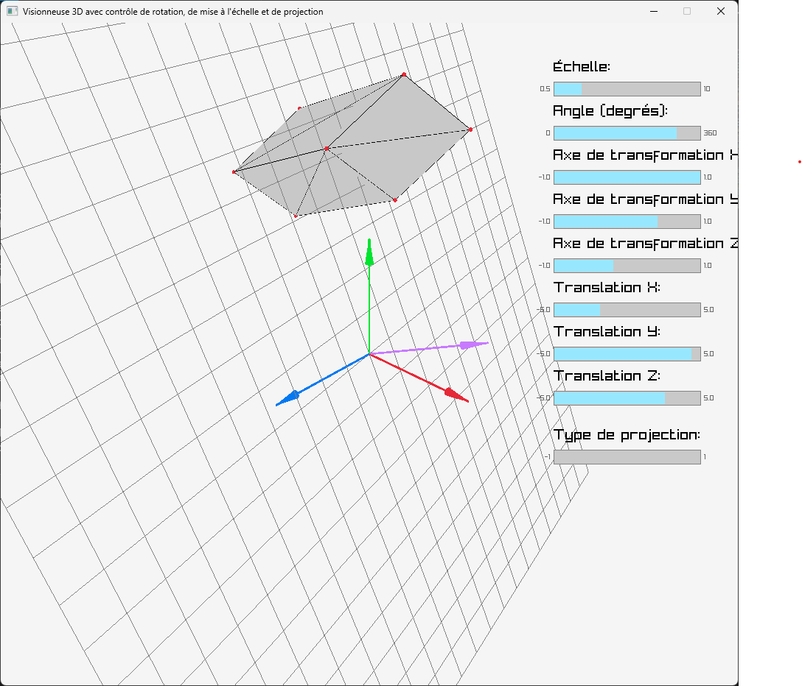

# Context

Instructions available in [sujet.pdf](./sujet.pdf).

# Requirements

1. Install Python
2. Install Python libraries

```bash
pip install numpy trimesh raylib
```

# Run programs

Run exercices:

```bash
python exoA.py
```

Replace `A` by the number of the target exercice.

# Results

## Exercice 1


